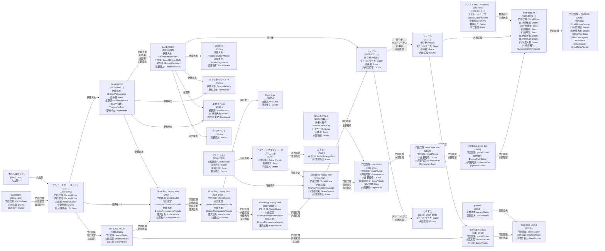

Family Tree

```mermaid
flowchart LR
  sweet["sweet girls<br/>(1994-1998)<br/>門田匡陽: Vocals/Bass<br/>内田武瑠: Drums<br/>城所祐一: Guitar"]
  maruyamaband["(丸山所属バンド)<br/>(1997-1998)<br/>丸山潤: ?"]
  sunchester["サンチェスター・ユナイテッドFC<br/>(1998-1999)<br/>門田匡陽: Vocals/Guitar<br/>内田武瑠: Vocals/Guitar<br/>丸山潤: Vocals/Guitar<br/>伊藤大地: Drums<br/>友人(城所祐一?): Bass"]
  burger1["BURGER NUDS<br/>(1999-2004)<br/>門田匡陽: Vocal/Guitar<br/>内田武瑠: Drums/Vocals<br/>丸山潤: Bass/Vocals"]
  gdhm04["Good Dog Happy Men<br/>(2004 ...)<br/>門田匡陽: Vocal/Guitar<br/>内田武瑠: Drums/Percussions/Vocals<br/>伊藤大地: Drums/Percussions/Vocals<br/>韮沢雄希: Bass/Vocals<br/>城所祐一: Guitar/Vocals"]
  gdhm0506["Good Dog Happy Men<br/>(2005-2006 ...)<br/>門田匡陽: Vocal/Guitar<br/>内田武瑠: Drums/Percussions/Vocals<br/>伊藤大地: Drums/Percussions/Vocals<br/>韮沢雄希: Bass/Vocals<br>[S]前田太一: Guitar"]
  gdhm0709["Good Dog Happy Men<br/>(2007-2009 ...)<br/>門田匡陽: Vocal/Guitar<br/>内田武瑠: Drums/Percussions/Vocals<br/>伊藤大地: Drums/Percussions/Vocals<br/>韮沢雄希: Bass/Vocals"]
  gdhm0910["Good Dog Happy Men<br/>(2009-2010 ...)<br/>門田匡陽: Vocal/Guitar<br/>内田武瑠: Drums/Percussions/Vocals<br/>[S]河相巧矢: Guitar/Vocals<br/>[S]菅原将之: Bass"]
  hisband["門田匡陽 -His Band-<br/>(2010-2011)<br/>門田匡陽: Vocal/Guitar<br/>[S]河相巧矢: Guitar/Vocals<br/>[S]水野雅昭: Drums<br/>[S]菅原将之: Bass/Vocals<br/>[S]金戸覚: Bass<br/>[S]高野勲: Keyboards"]
  calm["門田匡陽 with CalmCalm<br/>(2012)<br/>門田匡陽: Vocal/Guitar<br/>[S]水野雅昭: Drums<br/>[S]河相巧矢: Guitar/Vocals<br/>[S]maryne: Bass"]
  iwsgb["I Will Say Good Bye<br/>(2012)<br/>門田匡陽: Vocal/Guitar<br/>水野雅昭: Drums/Pad/Guitar<br/>[S]河相巧矢: Guitar/Vocals<br/>[S]wattch: Bass"]
  ptm["Poet-type.M<br/>(2013-2023 ...)<br/>門田匡陽: Vocal/Guita<br/>[S]水野雅昭: Drums<br/>[S]宇野剛史: Bass<br/>[S]伊賀航: Bass<br/>[S]金戸覚: Bass<br/>[S]伊藤大地: Drums<br/>[S]内田武瑠: Drums<br/>[S]中畑大樹: Drums<br/>[S]楢原英介: Guitar/Violin/Keyboards"]
  mondenSolo["門田匡陽ソロ (2020-)<br/>(2023-)<br/>門田匡陽: Vocal/Guitarr/Manip<br/>[S]水野雅昭: Drums<br/>[S]伊藤大地: Drums<br/>[S]maryne: Bass<br/>[S]Nao Yanagawa: Keyboards<br/>[S]kalminrot: Cho/Manip/Guitar"]

  curly["Curly Hair<br/>(2005-)<br/>前田太一: Guitar<br/>清家律子: Vocals"]
  spank["SPANK PAGE<br/>(2006-2012 ...)<br/>仲手川裕介: Vocals/Guitar/Key<br/>山下啓一郎: Guitar<br/>大成泰: Bass<br/>水野雅昭: Drums"]
  cherrys["Cherry's<br/>(2004-)<br/>伊藤大地: Vocals/Drums/Whistle<br/>冨樫春生: Vocals/Keyboards<br/>武藤雅孝: Vocals/Bass"]
  burger2["BURGER NUDS<br/>(2014-2018)<br/>門田匡陽: Vocal/Guitar<br/>内田武瑠: Drums/Vocals<br/>丸山潤: Bass/Vocals"]
  chopin1["ショピン<br/>(2009-2011 ...)<br/>野々歩: Vocals<br/>タカハシペチカ: Guitar<br/>田中馨: Bass<br/>[S]内田武瑠: Drums"]
  chopin2["ショピン<br/>(2011-)<br/>野々歩: Vocals<br/>タカハシペチカ: Guitar<br/>田中馨: Guitar<br/>内田武瑠: Drums"]
  sakerock1["SAKEROCK<br/>(2000-2002 ...)<br/>伊藤大地: Drums/Percussions<br/>田中馨: Bass<br/>星野源: Guitar/Marimba<br/>[S]浜野謙太: Trombone/Scat<br/>野村卓史: Keyboards"]
  sakerock2["SAKEROCK<br/>(2002-2015)<br/>伊藤大地: Drums/Percussions<br/>田中馨: Bass (2011年脱退)<br/>星野源: Guitar/Marimba<br/>浜野謙太: Trombone/Scat"]
  glh["グッドラックヘイワ<br/>(2004-)<br/>伊藤大地: Drums/Whistle<br/>野村卓史: Keyboards"]
  hosono["星野源 (solo)<br/>(2010-)<br/>星野源: Vocals/Guitar<br/>[S]伊藤大地: Drums<br/>[S]野村卓史: Keyboards"]
  hinemos["ヒネモス<br/>(2010-) [2004 結成]<br/>タカハシペチカ: Guitar<br/>内田武瑠: Drums<br/>..."]
  vola["VOLA & THE ORIENTAL MACHINE<br/>(2008-2012 ...)<br/>アヒト・イナザワ: Vocals/Guitar/Drums<br/>中畑大樹: Drums<br/>楢原英介: Guitar<br/>有江嘉典: Bass"]
  zainichi["在日ファンク<br/>(2007-)<br/>浜野謙太: Vocals<br/>..."]
  sentiline["センチライン<br/>(2001-2008)<br/>枝松直紀: Guitar/Vocals<br/>河相巧矢: Guitar<br/>尾崎宏明: Bass<br/>堀内啓史: Drums"]
  archaic["アルカイックスマイル・オブ・エリナ<br/>(2009)<br/>枝松直紀: Guitar/Vocals<br/>菅原将之: Bass<br/>平沼正人: Drums"]
  mikito["みきとP<br/>(2009-)<br/>みきとP: Write/Arrange/Mix<br/>[S]菅原将之: Bass"]
  paionia["paionia<br/>(2008-)<br/>高橋勇成:Vocals/Guitar<br/>菅野岳大: Bass/Vocals"]
  burger3["BURGER NUDS<br/>(2024-)<br/>門田匡陽: Vocal/Guitar<br/>内田武瑠: Drums/Vocals<br/>[S]菅野岳大: Bass/Vocals"]

  sweet -->|門田匡陽<br/>内田武瑠<br/>城所祐一?| sunchester
  maruyamaband -->|丸山潤| sunchester
  sunchester -->|門田匡陽<br/>内田武瑠<br/>丸山潤| burger1
  sunchester -->|伊藤大地| sakerock1
  burger1 -->|門田匡陽<br/>内田武瑠| gdhm04
  burger1 -->|門田匡陽<br/>内田武瑠<br/>丸山潤| burger2
  gdhm04 -->|門田匡陽<br/>内田武瑠<br/>伊藤大地<br/>韮沢雄希| gdhm0506
  sunchester -->|城所祐一?| gdhm04
  gdhm0506 -->|門田匡陽<br/>内田武瑠<br/>伊藤大地<br/>韮沢雄希| gdhm0709
  gdhm0506 -->|前田太一| curly
  gdhm0709 -->|門田匡陽<br/>内田武瑠| gdhm0910
  
  gdhm0910 -->|門田匡陽<br/>河相巧矢<br/>菅原将之| hisband
  gdhm0910 -->|内田武瑠| chopin1
  hisband -->|門田匡陽<br/>水野雅昭| calm
  calm -->|門田匡陽<br/>水野雅昭| iwsgb
  iwsgb -->|門田匡陽<br/>水野雅昭| ptm
  ptm -->|門田匡陽| mondenSolo
  burger2 -->|門田匡陽<br/>内田武瑠| burger3
  paionia -->|菅野岳大| burger3

  spank -->|水野雅昭| hisband
  sentiline -->|枝松直紀| archaic
  sentiline -->|河相巧矢| gdhm0910
  archaic -->|枝松直紀<br/>菅原将之| mikito
  archaic -->|菅原将之| gdhm0910

  sakerock1 -->|伊藤大地| gdhm04
  sakerock1 -->|伊藤大地<br/>田中馨<br/>星野源<br/>浜野謙太| sakerock2
  sakerock1 -->|野村卓史| glh
  sakerock1 -->|野村卓史| hosono
  sakerock2 -->|伊藤大地| cherrys
  sakerock2 -->|田中馨| chopin1
  sakerock2 -->|伊藤大地| glh
  sakerock2 -->|浜野謙太| zainichi
  sakerock2 -->|星野源| hosono

  chopin1 -->|野々歩<br/>タカハシペチカ<br/>田中馨<br/>内田武瑠| chopin2
  chopin1 -->|タカハシペチカ<br/>内田武瑠| hinemos
  chopin2 -->|内田武瑠| burger2
  chopin2 -->|内田武瑠| ptm

  vola -->|楢原英介<br/>中畑大樹| ptm
```
