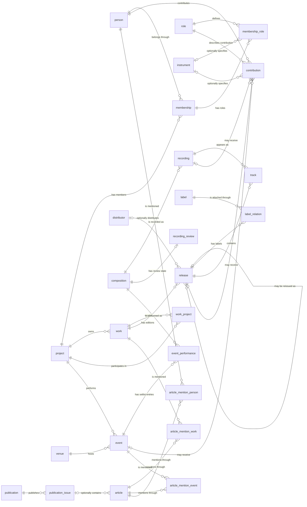

# Data Structure

This document describes the intended relational data structure in `database.sql`
and how generated seed data maps into it.

## High-Level Model

The database separates these concepts:

- `project`: an artist activity unit such as a band, solo name, or project.
- `person`: an individual musician or staff member.
- `membership`: a person belonging to a project for a period.
- `work`: an abstract released work or product concept.
- `release`: a concrete release/package of a work.
- `composition`: an abstract song/composition.
- `recording`: a specific recording/version of a composition.
- `track`: a track position on a release.
- `event`: a live event/performance date.
- `event_performance`: a performed composition in an event setlist.
- `venue`: a live venue.
- `publication` / `article`: media/article data, reserved for later expansion.
- `contribution`: person-level credits for release/recording/event.

## Core Relationships

```text
person
  └─ membership ── project
                    ├─ work ── release ── track ── recording ── composition
                    └─ event ── event_performance ───────────── composition

event ── venue

membership ── membership_role ── role
                              └─ instrument
```

## Entity Relationship Diagram



`contribution` は `recording`、`release`、`event`
のいずれか一つだけを対象にする。 この排他的な制約は Mermaid
のカーディナリティでは表現できないため、データベースの
`contribution_single_target_check` 制約で保証する。

## Project

Table: `project`

Represents an activity name or artist unit.

Examples:

- `BURGER NUDS`
- `Good Dog Happy Men`
- `Poet-type.M`
- `門田匡陽 (ソロ名義/2010)`
- `門田匡陽 (ソロ名義/2020-)`

Important rule:

Do not put metadata tags into `project`.

Invalid project names include:

- `予定`
- `単独ライブ`
- `_incomplete`
- `Album`
- `公開されたデモ音源リスト`

These are metadata, status, format, or index titles, not activity units.

Generated by:

- `scripts/generate_rawdata_seed_sql.ts`
- `scripts/generate_people_seed_sql.ts`

Quality checks:

- `sql/project_quality_checks.sql`
- `sql/project_overview.sql`

## Person / Membership

Tables:

- `person`
- `membership`
- `role`
- `instrument`
- `membership_role`

`person` stores individual people.

`membership` connects a `person` to a `project` with a date range.

`membership_role` stores what the person did in that membership, using `role`
and optional `instrument`.

Current default role:

- `performer`

Current instruments are normalized English tokens such as:

- `vocal`
- `guitar`
- `bass`
- `drums`
- `chorus`
- `keyboard`
- `synthesizer`
- `programming`

Generated by:

```bash
bun run scripts/generate_people_seed_sql.ts \
  --person-dir rawData/articles_by_category/person \
  --biography-dir rawData/articles_by_category/biography \
  --output sql/people_seed.sql
```

Primary sources:

- `rawData/articles_by_category/person/`
- `rawData/articles_by_category/biography/`

Current limitations:

- Membership dates may be approximate.
- Support members are identified by `membership.support = true`.
- Role/instrument extraction is heuristic and should be reviewed via
  `sql/people_overview.sql`.

## Work / Release

Tables:

- `work`
- `release`
- `label`
- `distributor`
- `label_relation`

`work` is the abstract product/work. `work.type` distinguishes:

- `original`: an original work
- `compilation`: a multi-artist compilation or sampler
- `best`: a same-artist edited/best album
- `live`: a collection of recordings from a live performance

`work_project` connects a work to one or more projects.
`relation_type = primary` marks the primary credited project, while
`participant` marks an artist appearing on a multi-artist work.

`release` is a concrete released package or distribution instance.
`release.edition_type = reissue` marks a reissue, and
`release.reissue_of_release_id` points to its original release. Track-list
changes between editions are represented by each release's own `track` rows.
`label` stores canonical label names only; markdown links, slash-separated
aliases, and note suffixes are normalized out of the generated name.
`distributor` stores the separate distribution company/name when the source text
provides it.

Examples:

```text
project: Good Dog Happy Men
work: Most beautiful in the world
release: Most beautiful in the world (ハイライン版)
release: Most beautiful in the world (全国流通版)
```

Generated by:

```bash
bun run scripts/generate_rawdata_seed_sql.ts \
  --source-dir rawData/articles_by_category/release \
  --types release \
  --output sql/release_seed.sql
```

Supplemental releases without dedicated release articles are generated by:

```bash
bun run db:generate:band-releases
```

This generator emits curated `work`, `release`, `label`, `distributor`, and
`label_relation` rows for compilation or sampler appearances found in
band/article source files. For these supplemental entries, `work.released_date`
stores the representative first release date for the abstract work, and
`release.release_date` stores the concrete package/distribution date; currently
they are the same because each supplemental work has one known release instance.

Dedicated label articles populate `label.description`:

```bash
bun run db:generate:labels
```

This does not generate release rows from label article catalog lists. Release
rows remain sourced from release articles and curated supplemental release
seeds.

Primary source:

- `rawData/articles_by_category/release/`
- `rawData/articles_by_category/band_*` source files for supplemental
  compilation/sampler releases
- `rawData/articles_by_category/label/` for label descriptions

Important rules:

- `Release` is a category tag, not a project name.
- Format tags like `Album` are not project names.
- Index/list pages should not become releases.
- `公開されたデモ音源リスト` is skipped because it is a list page, not a
  release.

Overview:

- `sql/release_overview.sql`

## Composition

Table: `composition`

Represents an abstract song/composition independent of recording, release, or
performance.

Examples:

- `ミナソコ`
- `Bit by bit`
- `(can you feel?)～Most beautiful in the world～`

Generated by:

```bash
bun run scripts/generate_composition_seed_sql.ts \
  --output sql/composition_seed.sql
```

Primary source:

- `drafts/compositions/*.md`

Important rule:

Only drafts with `status: reviewed` should become canonical `composition` rows.

Draft statuses:

- `draft`: not reviewed, do not import.
- `reviewed`: import as canonical composition.
- `merged`: do not import; sources should be merged into another reviewed draft.
- `split`: do not import; needs manual split handling.
- `ignore`: do not import.

Why this exists:

Raw track names and setlists contain spelling variations, annotations, covers,
version notes, and mistakes. Human canonicalization prevents duplicate or wrong
compositions.

Review UI:

```bash
bun run review:compositions
```

## Recording / Track

Tables:

- `recording`
- `recording_review`
- `track`

`recording` is a specific recorded version of a `composition`. Its `type` is
required, defaults to `studio`, and is one of `studio`, `live`, `demo`,
`rehearsal`, or `other`.

`composition.title` identifies the abstract composition. `recording.version_name`
is the standalone display name of a particular variation and includes enough of
the composition title to make sense without surrounding context. It is not only
the qualifier inside parentheses or brackets.

Examples:

- `ANALYZE [Lost Verse(s) ver.]`
- `Nightmare's Beginning (Acoustic ver.)`
- `Kireigoto ("あのキラキラした綺麗事を (AGAIN)" rearrange)`

Use a source alias as `version_name` when that alias expresses the full
variation title. Do not store only `Lost Verse(s) ver.` or `Acoustic ver.`.
`version_name` does not need to begin with the canonical `composition.title`
when the source gives the variation a distinct standalone title such as
`Kireigoto`.

`recording.version_description` stores concise prose about characteristics that
are not already clear from `version_name`, such as `2018 remix` or a distinctive
arrangement or vocalist. It should not duplicate the version name, release
title, provenance, or uncertain annotations. Leave both version fields null
when the source does not identify a specific variation.

`recording.type` and `version_name` are independent: `type` classifies how the
recording was made, while `version_name` identifies which variation it is.
Aliases are evidence for these fields, but proposals must be human-reviewed
because aliases also contain spelling variants and live-performance notes.

`track` places a `recording` on a `release` with `track_number`.

`recording_review` stores the human review state for a composition. Its
`assignment_fingerprint` is derived from the current stable
`track.id → track.recording_id` assignment, so adding a track or moving it to
another recording automatically makes the composition pending review again.

Generated by:

```bash
bun run scripts/generate_work_seed_sql.ts \
  --source-dir rawData/articles_by_category/release \
  --composition-draft-dir drafts/compositions \
  --output sql/release_tracks_seed.sql
```

Primary sources:

- Release Markdown track lists: `## 収録曲` / `## 曲リスト`
- Reviewed composition drafts: `drafts/compositions/*.md`

Mapping rule:

`track -> recording -> composition` uses the reviewed composition draft source
entries.

If a release track source maps to a reviewed draft, the reviewed
`composition_id` is used.

If a source maps to `ignore` or `split`, it is skipped.

Fallback composition insertion should be treated as a warning and reviewed.

## Venue / Event

Tables:

- `venue`
- `event`

`venue` stores venue name and location.

`event` stores a dated activity for a project at a venue. Live performances,
exhibitions, and listening events are all stored here.

`event.type` classifies the broad event kind:

- `live`
- `exhibition`
- `listening_event`

Generated by:

```bash
bun run scripts/generate_rawdata_seed_sql.ts \
  --source-dir rawData/articles_by_category/Live \
  --types live \
  --output sql/live_seed.sql
```

```bash
bun run scripts/generate_rawdata_seed_sql.ts \
  --source-dir rawData/articles_by_category/event \
  --types event \
  --output sql/event_seed.sql
```

Primary source:

- `rawData/articles_by_category/Live/`
- `rawData/articles_by_category/event/`

Important rules:

- `Live` is a category tag, not a project name.
- `Event` is a category tag, not a project name.
- Tags such as `単独ライブ`, `予定`, `_incomplete` are metadata and not project
  names.
- Project is inferred from the first valid project tag, or from the title prefix
  when needed.
- Multi-day event end dates are not modeled as a separate column; preserve the
  original date range in `event.description`.

Overview:

- `sql/event_overview.sql`

## Event Performance

Table: `event_performance`

Represents one performed composition in an event setlist.

Generated by:

```bash
bun run scripts/generate_live_performance_seed_sql.ts \
  --source-dir rawData/articles_by_category/Live \
  --composition-draft-dir drafts/compositions \
  --output sql/live_performances_seed.sql
```

Primary sources:

- Live Markdown setlists: `## セットリスト*`
- Reviewed composition drafts: `drafts/compositions/*.md`

Mapping rule:

`event_performance.composition_id` is resolved through reviewed composition
draft source entries.

If a setlist item maps to `ignore`, `split`, or an unreviewed draft, it is
skipped.

## Publication / Article

Tables:

- `publication`
- `publication_issue`
- `article`
- `article_mention_work`
- `article_mention_event`
- `article_mention_person`

`publication`, `publication_issue`, and `article` are populated from the media
category.

Generated by:

```bash
bun run scripts/generate_media_seed_sql.ts \
  --source-dir rawData/articles_by_category/media \
  --output sql/media_seed.sql
```

Primary source:

- `rawData/articles_by_category/media/`

Mapping rules:

- `publication` is the durable container: radio program, TV program/special,
  Web掲載 index, or ラジオ出演 index.
- `publication_issue` is a broadcast airing, publication date, or synthetic
  index issue used to attach a source file to a publication path.
- `article` is one imported media Markdown source file.
- Episode-list source files are stored as `article.type = 'episode_list'`;
  listed rows are not exploded into separate `article` rows yet.
- Transcript and excerpt source files attach to their concrete episode issue
  when known.
- Provenance is preserved in `article.summary` using `source_file=...` and
  `source_tags=...`.

Current limitation:

- `article_mention_work`, `article_mention_event`, and `article_mention_person`
  are not generated yet.

## Contribution

Table: `contribution`

Represents person-level credits for exactly one of:

- `recording`
- `release`
- `event`

The table has a check constraint enforcing that exactly one of those target IDs
is set.

Generated by:

```bash
bun run scripts/generate_contribution_seed_sql.ts \
  --live-dir rawData/articles_by_category/Live \
  --release-dir rawData/articles_by_category/release \
  --output sql/contribution_seed.sql
```

Current generated scope:

- Live support members from `rawData/articles_by_category/Live/`
- Release-level two-column credit tables from
  `rawData/articles_by_category/release/` `## クレジット`
- Recording-level performer matrices from
  `rawData/articles_by_category/release/` `## クレジット`
- `role.name = 'support_performer'` for live support members
- Release-level roles such as `lyricist`, `composer`, `arranger`, `producer`,
  `recording_engineer`, `mixing_engineer`, `mastering_engineer`, `artwork`,
  `a_and_r`, `management`, `guest_vocal`, `guest_chorus`, `guest_performer`,
  `vocal_director`, `director`, `assistant_director`, `camera`, `photographer`,
  `staff`, and `executive_producer`
- Optional `instrument_id` from normalized support member instrument labels
- `event_id` set from the source filename using the same event UUID rule as live
  seed generation
- `release_id` set from the release source filename using the same release UUID
  rule as release seed generation
- `recording_id` set from the release track seed lookup using the same recording
  UUID rule as release track generation
- `notes` preserve `source_file=...` and `raw_credit=...`

Expected future expansion:

- event staff credits

## Import Order

Recommended import order:

```text
1. release_seed.sql
2. band_release_seed.sql
3. label_seed.sql
4. composition_seed.sql
5. release_tracks_seed.sql
6. live_seed.sql
7. event_seed.sql
8. live_performances_seed.sql
9. people_seed.sql
10. contribution_seed.sql
11. media_seed.sql
```

Corresponding commands:

```bash
docker compose exec -T postgres psql -U monden -d monden < sql/release_seed.sql
docker compose exec -T postgres psql -U monden -d monden < sql/band_release_seed.sql
docker compose exec -T postgres psql -U monden -d monden < sql/label_seed.sql
docker compose exec -T postgres psql -U monden -d monden < sql/composition_seed.sql
docker compose exec -T postgres psql -U monden -d monden < sql/release_tracks_seed.sql
docker compose exec -T postgres psql -U monden -d monden < sql/live_seed.sql
docker compose exec -T postgres psql -U monden -d monden < sql/event_seed.sql
docker compose exec -T postgres psql -U monden -d monden < sql/live_performances_seed.sql
docker compose exec -T postgres psql -U monden -d monden < sql/people_seed.sql
docker compose exec -T postgres psql -U monden -d monden < sql/contribution_seed.sql
docker compose exec -T postgres psql -U monden -d monden < sql/media_seed.sql
```

## Quality Checks

General checks:

```bash
docker compose exec -T postgres psql -U monden -d monden < sql/quality_checks.sql
```

Project checks:

```bash
docker compose exec -T postgres psql -U monden -d monden < sql/project_quality_checks.sql
```

Useful overview queries:

```bash
docker compose exec -T postgres psql -U monden -d monden < sql/project_overview.sql
docker compose exec -T postgres psql -U monden -d monden < sql/release_overview.sql
docker compose exec -T postgres psql -U monden -d monden < sql/event_overview.sql
docker compose exec -T postgres psql -U monden -d monden < sql/people_overview.sql
```

## Current Known Limitations

- `article_mention_*` ingestion is not implemented yet.
- `contribution` ingestion currently covers live support members, release-level
  credit tables, and recording-level track performer matrices; event staff
  credits are not implemented yet.
- Membership support distinctions are stored in the `membership.support` boolean
  column.
- Approximate dates are represented by date plus precision fields where
  available.
- Composition aliases are stored in draft descriptions for now; there is no
  dedicated `composition_alias` table.
